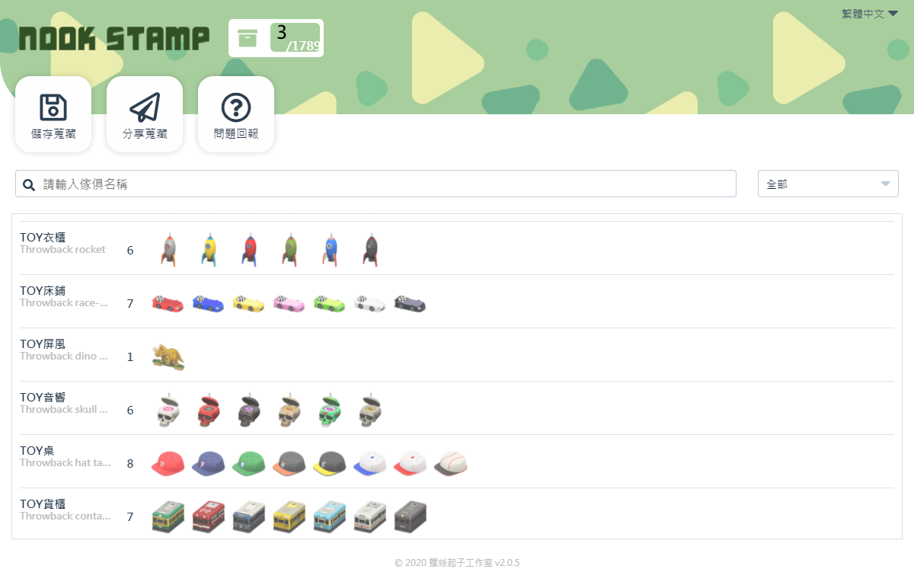
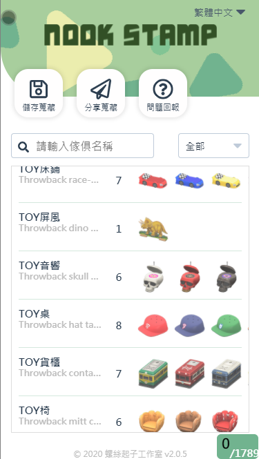

# Nookstamp 傢俱搜集器 2020 螺絲起子工作室出品。

>2020/05 https://nookstamp.com/

NookStamp is a web application written in React for ACNH. The main features of this application are to help you collect orderable furnitures, share collections with friends.

開發的初衷在於遊戲，苦手如我晚了其他人好一陣子才開始動物森友會的無人島生活。

玩了半個多月的撿樹枝撿石頭，僅能靠乾媽乾爹贊助我道具，
蒐集魂爆發又苦無有效方法。

心想一定有更方便記錄道具的方法阿~

直至某天天靈蓋一道念頭直衝腦門，
於是於平常假日會議工作團偶然提起，臨時起意開發了一週，
經過小夥夥伴們跨越時區日以繼夜的趕工。"Nookstamp 傢俱搜集器"成了我們工作室的第一個作品。

--------------------------------------

* 開發日誌 https://mike-zheng.github.io/posts/nookstmp/

* 服務備份 https://mike-zheng.github.io/nookstamp/